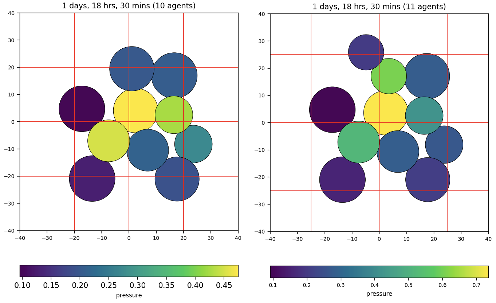
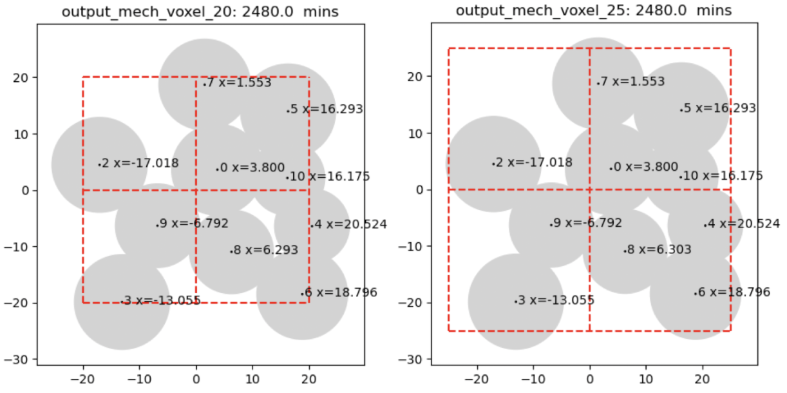

## Explanation of why different mechanics voxel sizes can lead to different results


Let's begin with an agreed upon premise: running a simulation on the same machine (same OS release, same compiler, etc), with 
* the same model parameters,
* same initial conditions (ICs),
* no cell rules,
* using a single thread (1 core), and
* using the same seed for the PRNG (pseudo-random number generator),

we should get the very same, exact, bitwise reproducible results.

Now, what happens if we change just one model parameter - the mechanics voxel size? Will that affect reproducibility and, if so, by how much? In this unit test, we do just that: we compare a simulation using mechanics voxel size =20 to another using 25; all other parameters are the same.

The model is quite simple: it has a single cell type ("default") and the ICs has a single cell starting at the origin (0,0). At the end of our simulations, we see these results - the left using mechanics voxel size=20, the right =25. One thing to point out are that the cell pressures are quite different - notice the colorbars. The left has a max of ~0.45; the right a max of ~0.7. Why? Because a cell's pressure is a function of its neighbor cells and when we have different mechanics voxel sizes, it is quite possible for a cell to have a different number of neighbors (as is the case here).






Note the top row is at a later time (2550 mins) than the lower row. Also note the x-positions differ for cell ID 8 (lower row, lower center). Why? It's due to the logic of how cell-cell repulsion is computed. In the left frame, cell 4 is (barely) outside the mechanics voxel of cell 8; in the right frame, cell 4 is inside. That is sufficient to cause a slight difference in cell 8's computed position due to repulsion with its neighbors.

Next, let's address the reason for the simulation on the left having 10 cells and the one on the right having 11 cells (at the same simuation time). First, it should be pointed out that the cell cycle for "default" is stochastic (as it typical). This involves using a Poisson process in PhysiCell which involves calling the `UniformRandom()` method. For two simulations to generate the same (identical) results, it should be obvious that `UniformRandom()` will be invoked at the very same times, thereby generating the same sequence of random numbers. Is it possible that changing the mechanics voxel size will alter this behavior? Yes. At least one section of code (in release 1.14.2) where this is possible is in:
```
In PhysiCell_standard_models.cpp: the "standard_cell_cell_interactions" function:

	for( int n=0; n < pCell->state.neighbors.size(); n++ )
	{
            …

			if( UniformRandom() < probability && fused == false  ) 
			{
				pCell->fuse_cell(pTarget);
```
Recall that changing the mechanics voxel size leads to the possibility of changing a cell's neighbors and this, in turn, leads to invoking `UniformRandom` in the Poisson process highlighted above. And if `UniformRandom()` is called more (or less) often in one simulation than another, then a cell's (stochastic) cycle may have a different outcome, potentially leading to additional cell division, as is the case here (10 cells vs. 11).
<!--
```
(base) M1P~/git/mech_grid_xml$ python beta/plot_cell_ids.py output_mech_voxel_20 1240 20
->
nbrs= {0: {5, 7, 8, 9, 10}, 2: {9}, 3: {9}, 4: {8, 10, 6}, 5: {0, 10, 7}, 6: {8, 4}, 7: {0, 5},
8: {0, 9, 10, 6},
9: {8, 0, 2, 3}, 10: {0, 8, 4, 5}}

(base) M1P~/git/mech_grid_xml$ python beta/plot_cell_ids.py output_mech_voxel_25 1240 25
->
nbrs= {0: {5, 7, 8, 9, 10}, 2: {9}, 3: {9}, 4: {8, 10, 6}, 5: {0, 10, 7}, 6: {8, 4}, 7: {0, 5},
8: {0, 4, 6, 9, 10},
9: {8, 0, 2, 3}, 10: {0, 8, 4, 5}}
``
-->
